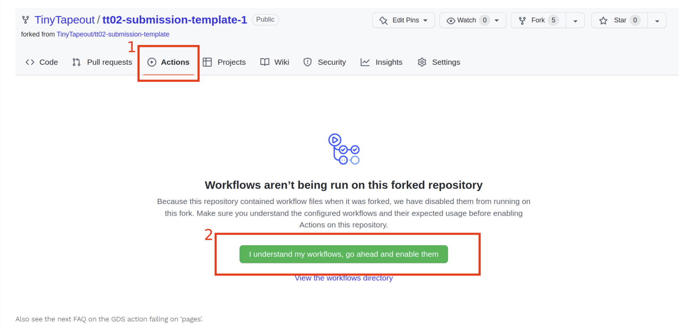

# Introduction and Important Notes
Hi, welcome to UW ASIC!

This series should help you to play around with some of the tools you will be using to participate in anything TinyTapeout.

We highly encourage you to ask questions as they come up in the team Discord. It's likely that other people have the same problem(s). Plus, it's a first chance for us to work together. You can also go to the tiny tapeout website, which has lots of FAQs under FAQ.

This is by no means mandatory. If you really wanted to, you can see what bugs I added through the commit history. That isn't the point, rather it is a chance for you to get acquainted with some of the tools we will be using.

⭐ Please **DO NOT** make your edits directly to this repository, or try to commit them / make a PR. Rather, **fork it** and play around with your repo as much as you want.

📖 Current Version / Version History:
v1.0 - Just starting out!

Contributors: Gerry Chen

## Instructions

1. Once you have created the forked repo, go to Settings -> Actions -> Allow all actions and reusable workflows.
Alternatively, go to Actions as shown below:

2. Go to Actions, and click on the first failing gds run. If the run is still running, give it a couple minutes to become a red X. If no action is running, try commiting something (anything) to the repo. The actions are set to run on commit.

3. Click on "gds" and observe the failing logs. When the gds run fails, normally you can find clues near the error message of what went wrong. 

Clue #1: there are 2 things immediately wrong simultaneously!

4. Go to info.yaml to fix the above, but also name the pins something more descriptive. otherpin is a terrible name... Normally we name all of the ones we use.

Clue #2: gds uses info.yaml to collect information about how it should build the project.

Clue #3: you can find the source Verilog code at ./src/

5. Keep using the clues to play with the repo until all three of the workflows are green. At that point, you can move on to pt 2 linked below!

Hint: the workflow is only checking if the text is edited / has some content... It doesn't matter what it is....

See below for the template instructions / readme. This is a copy of the TT10 template. Between templates there aren't generally too too many edits. The templates are created by the actual TT team.

   
# Tiny Tapeout Verilog Project Template

- [Read the documentation for project](docs/info.md)

## What is Tiny Tapeout?

Tiny Tapeout is an educational project that aims to make it easier and cheaper than ever to get your digital and analog designs manufactured on a real chip.

To learn more and get started, visit https://tinytapeout.com.

## Set up your Verilog project

1. Add your Verilog files to the `src` folder.
2. Edit the [info.yaml](info.yaml) and update information about your project, paying special attention to the `source_files` and `top_module` properties. If you are upgrading an existing Tiny Tapeout project, check out our [online info.yaml migration tool](https://tinytapeout.github.io/tt-yaml-upgrade-tool/).
3. Edit [docs/info.md](docs/info.md) and add a description of your project.
4. Adapt the testbench to your design. See [test/README.md](test/README.md) for more information.

The GitHub action will automatically build the ASIC files using [OpenLane](https://www.zerotoasiccourse.com/terminology/openlane/).

## Enable GitHub actions to build the results page

- [Enabling GitHub Pages](https://tinytapeout.com/faq/#my-github-action-is-failing-on-the-pages-part)

## Resources

- [FAQ](https://tinytapeout.com/faq/)
- [Digital design lessons](https://tinytapeout.com/digital_design/)
- [Learn how semiconductors work](https://tinytapeout.com/siliwiz/)
- [Join the community](https://tinytapeout.com/discord)
- [Build your design locally](https://www.tinytapeout.com/guides/local-hardening/)

## What next?

- [Submit your design to the next shuttle](https://app.tinytapeout.com/).
- Edit [this README](README.md) and explain your design, how it works, and how to test it.
- Share your project on your social network of choice:
  - LinkedIn [#tinytapeout](https://www.linkedin.com/search/results/content/?keywords=%23tinytapeout) [@TinyTapeout](https://www.linkedin.com/company/100708654/)
  - Mastodon [#tinytapeout](https://chaos.social/tags/tinytapeout) [@matthewvenn](https://chaos.social/@matthewvenn)
  - X (formerly Twitter) [#tinytapeout](https://twitter.com/hashtag/tinytapeout) [@tinytapeout](https://twitter.com/tinytapeout)
